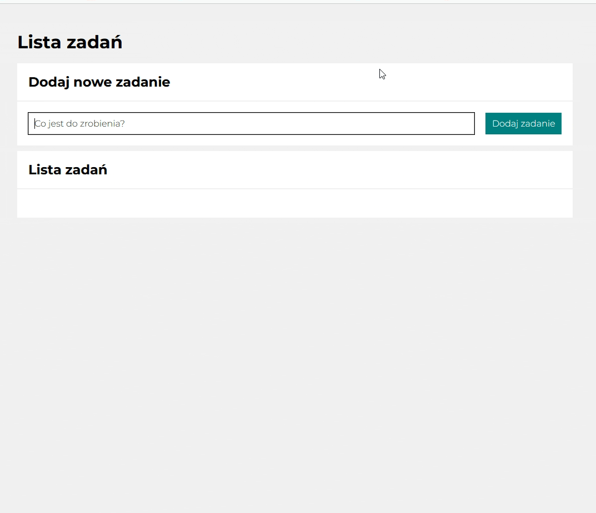

# Task-list

Simple task-list, you can add your tasks, mark them as completed and/or delete them.

## Usage

Just enter your task in the input field and then press the "Dodaj zadanie" button. You can mark a task as done by clicking on the green box and delete it by clicking on the red trash can.

### DEMO

